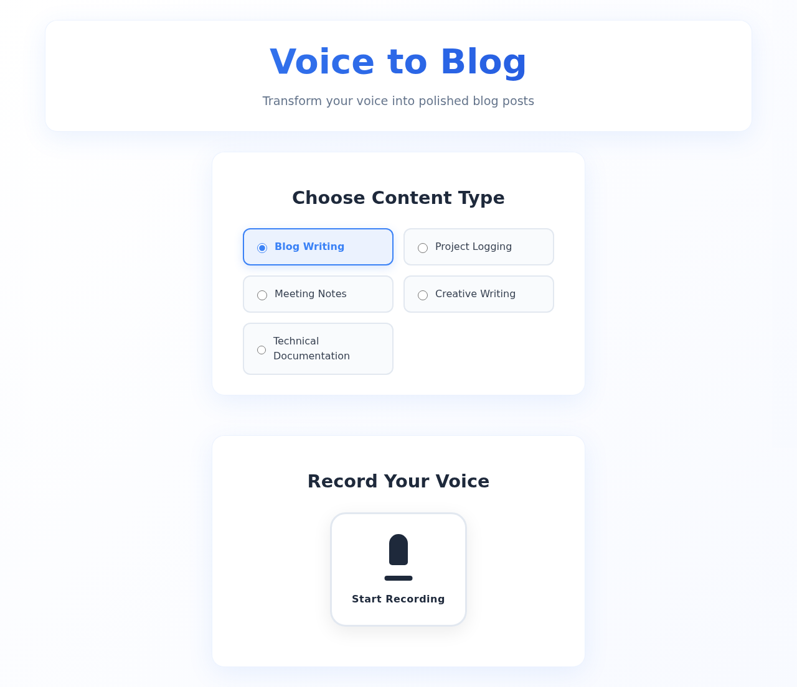
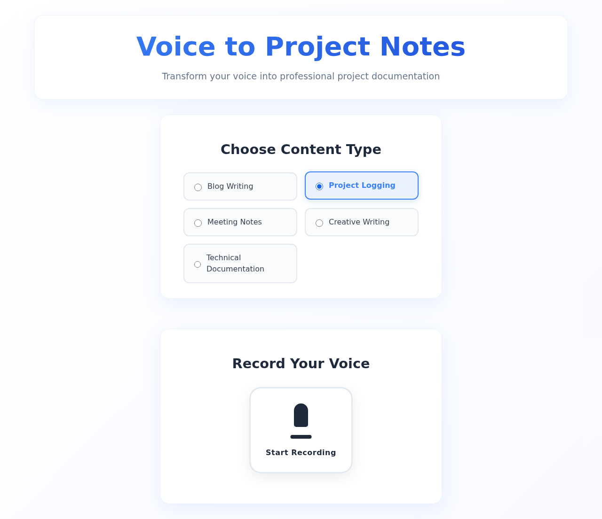
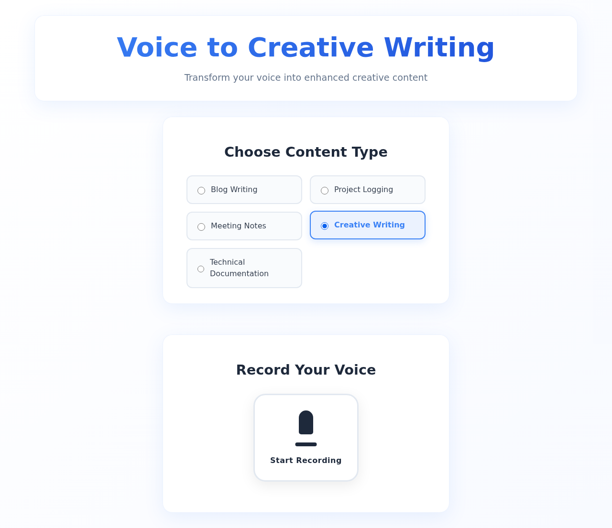

# Lazy Blogger - Prompt Selection Feature

This documentation covers the new prompt selection system that allows users to choose different content types instead of being limited to just blog writing.

## Features

### Prompt Types Available

1. **Blog Writing** - Transform voice to polished blog posts (original functionality)
2. **Project Logging** - Professional project documentation 
3. **Meeting Notes** - Organized meeting documentation
4. **Creative Writing** - Enhanced creative content
5. **Technical Documentation** - Clear technical docs

### Dynamic UI Updates

The user interface dynamically updates based on the selected prompt type:

- **Title** changes (e.g., "Voice to Blog" → "Voice to Project Notes")
- **Subtitle** provides context-specific description
- **Output section** labels adjust to match content type

## Screenshots

### Blog Writing Mode (Default)

### Project Logging Mode

### Creative Writing Mode

## Technical Implementation

### Backend Changes
- Added `PROMPT_CONTEXTS` dictionary with specialized prompts for each content type
- Modified API to accept `prompt_type` parameter
- Updated grammar correction function to use appropriate prompt

### Frontend Changes
- Added radio button interface for prompt selection
- Implemented dynamic UI text based on selection
- Updated API calls to include selected prompt type
- Added responsive CSS styling for prompt selection

## Usage

1. Visit the dashboard
2. Select desired content type from the "Choose Content Type" section
3. Record your voice as usual
4. The AI will process your transcription according to the selected prompt type
5. Review the formatted output that matches your chosen content style